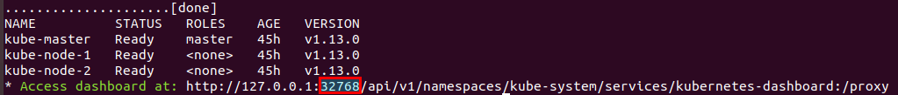
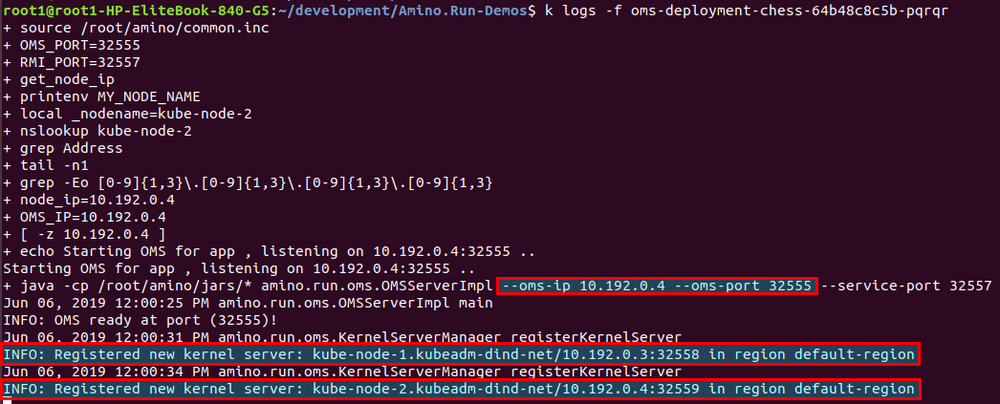

# Kubernetes Deployment

### Prerequisites
Docker daemon with docker client. Tested with Docker community edition ```(18.09.6)```.

### Steps
Set up Kubernetes cluster on your system by running the following script:
```
bash k8s-deployment/dind_k8s_cluster.sh up
```  
1. The script downloads kubectl and sets it in ```/usr/local/bin``` PATH environment variable.  
**NOTE:**  
i. It downloads kubectl version ```v1.13.0```, if you already have some other version of kubectl downloaded keep a backup of it.  
ii. Ensure ```/usr/local/bin``` is set in PATH environment variable as this is where the script places your kubectl.  
2. The script sets up Kubernetes cluster (Version v1.13) based on DIND(Docker in Docker). An alternate version of Kubernetes can be set up by following steps given in this [link](https://github.com/kubernetes-sigs/kubeadm-dind-cluster).   
3. Upon successful execution of the script a unique link to access the kubernetes-dashboard is generated.  


## OMS and KernelServer deployment in Kubernetes
### Prerequisites
1. Set credentials ```repo.username``` and ```repo.password``` in ```Amino.Run-Demos/gradle.properties``` file for access to the [dockerhub](https://hub.docker.com) repo.
2. In the same file, change the port in the ```baseURL``` and replace it with the proxy port of kubernetes (Proxy port varies as per local kubernetes deployment).  

3. Ensure generation of fatJar for application at subprojects/build/libs.  
    ```
    bash gradlew build
    ```

### Steps
1. Push image to dockerhub by executing the following command:
```
bash gradlew <appName>:subprojects:pushImage
```

* Upon execution of the above task a Dockerfile gets generated in respective ```subproject``` folder of application.
* The same Dockerfile is further used to build an image. This image contains the fatJar file and is used for running the OMS, kernelServer and the application.
* The image is then pushed to the [dockerhub](https://hub.docker.com) using the credentials set in the gradle.properties file:
    ```
    repo.username=xxxx
    repo.password=xxxx
    ```
    This image is pushed as a public image.
2. To deploy OMS:
```
bash gradlew <appName>:subprojects:deployOms
```
3. To run a single KernelServer:
```
bash gradlew <appName>:subprojects:deployKernelServer
```
4. To run more than one KernelServer, use:
```
bash gradlew <appName>:subprojects:deployKernelServer -PksNum=<n>
```
where, n represents the kernelServer number to run. If not specified, by default it takes the value to be 1.

## Running the Application
### Steps

1. Update the OMS ip and port in the configuration file of the applications.  
i. Replace OMS ip with node ip.  
ii. Replace OMS port with OMS NodePort. Details for the same can be found by viewing the oms logs.  
      
2. For chess application we also need to change the kernelServers ip and port in the configuration file. Details for kernelServer ip and port can be found by viewing the oms logs as highlighted in the image above.  
3. Finally run the app by clicking on the run app icon from within the IDE.

 
       

 
   
    
